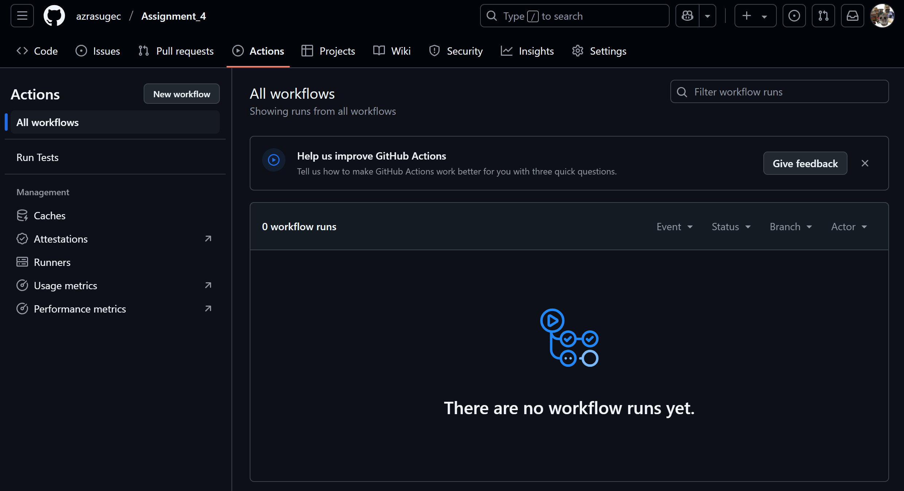
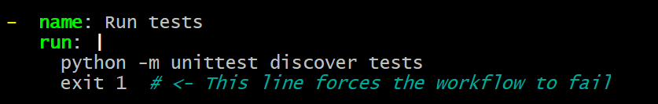

# Assignment 4 - Bubble Sort Implementation

## 📌 Introduction

This project is developed as part of Assignment #4, where the goal is to implement the bubble sort algorithm in Python in a flexible way that supports both standard Python lists and custom LinkedList objects.

The original `bubble_sort` implementation worked only with Python lists. In this assignment, I extended the functionality to support LinkedList objects as well, enabling sorting on both data structures without breaking the original code.

The assignment involves:
- Creating a LinkedList structure,
- Extending the `bubble_sort` function to handle both data types,
- Writing test cases with `unittest`,
- Automating tests using GitHub Actions,
- Documenting the process step-by-step.

## 📄 Project Structure
```
Assignment_4/
├── ds.py                      # LinkedList and Node classes
├── sorting_algorithms.py     # Extended bubble_sort function
├── main.py                   # Script to test sorting manually
├── tests/
│   └── test_sorting.py       # Unit test cases
├── .github/
│   └── workflows/
│       └── python-tests.yml  # GitHub Actions workflow
├── .gitignore
└── README.md
```

---

## ✅ Steps & Visual Documentation


### Step 1 – Creating the data structure file

I navigated to the local `Assignment_4` project directory and created a new file called `ds.py` using the terminal. This file will contain the Linked List implementation, which is necessary to extend the bubble sort function for linked list input.


### Step 2 – Implementing the Linked List class

In the file `ds.py`, I implemented a simple singly linked list structure to support the `bubble_sort` algorithm with non-array inputs.

- The `Node` class defines a single element of the list, holding data and a pointer to the next node.
- The `LinkedList` class provides methods to:
  - Initialize the list,
  - Append new data,
  - Print all nodes (`print_all_nodes` – for debugging),
  - Iterate over the list using `__iter__`.

The `__iter__` method is especially important as it allows the linked list to be used in a Pythonic way (e.g., in `for` loops or when unpacking).

Additionally, I created a `convert_to_linked_list(input_list)` function to convert regular Python lists into `LinkedList` objects.


### Step 3 – Preparing to update the sorting function

I opened the `sorting_algorithms.py` file to modify the `bubble_sort` function. The goal here is to extend its functionality so that it can sort not only Python lists but also Linked Lists implemented in `ds.py`.

This step is crucial because the original implementation supports only native lists. The enhanced version will be able to iterate over a Linked List using its `__iter__` method.


### Step 4 – Modifying the `bubble_sort` function

I extended the `bubble_sort` function in `sorting_algorithms.py` to support both standard Python lists and custom LinkedList objects.

- For standard lists:
  - I used the classic bubble sort algorithm using index-based iteration.

- For LinkedLists:
  - I checked whether the input has a `head` attribute to determine if it behaves like a LinkedList.
  - I implemented nested loops using `current` and `next_node` pointers to traverse and compare nodes.
  - When needed, I swapped the `.data` values of the nodes without changing the node references.

This dual implementation allows the function to sort both iterable lists and node-based data structures without breaking the original functionality.


### Step 5 – Creating a `main.py` file to test the implementation

I created a file named `main.py` to manually run and test the `bubble_sort` function for both data types: a Python list and a LinkedList.

This file is useful for debugging, demonstrating results, and validating that the sorting logic works correctly before moving on to unit testing and GitHub Actions integration.


### Step 6 – Testing the sorting logic with both Python list and LinkedList

In `main.py`, I tested the `bubble_sort` implementation using two different data types:

- **Part I – Python List:**
  - A sample list of integers in descending order is sorted using the standard logic.
  - The result is printed directly.

- **Part II – LinkedList:**
  - The same list is converted into a `LinkedList` using the `convert_to_linked_list()` function.
  - The sorting function is applied, and the result is printed node by node using the `print_all_nodes()` method.

This test validates that both versions of the `bubble_sort` function (for list and linked list) work as expected.


### Step 7 – Creating unit tests for the sorting algorithm

I created a new file `tests/test_sorting.py` to write unit tests using the `unittest` module in Python. These tests validate the behavior of the `bubble_sort` function on both Python lists and LinkedLists.

This ensures that:
- The sorting algorithm works correctly with different data structures.
- Future code changes can be safely tested via automation.
- The project is ready for GitHub Actions CI integration.


### Step 8 – Validating the sorting logic with unit tests

In `tests/test_sorting.py`, I implemented two unit test methods using Python’s built-in `unittest` framework:

- `test_bubble_sort_list`: Checks whether `bubble_sort` correctly sorts a Python list.
- `test_bubble_sort_linked_list`: Converts a list to a LinkedList, sorts it, and compares the output to the expected result (by converting the LinkedList back to a list using `list()` and `__iter__`).

The tests confirm that the sorting logic is consistent across both data structures. Running this script with `unittest.main()` allows automated testing from the terminal or CI pipelines.


### Step 9 – Running all unit tests

To validate the functionality of the `bubble_sort` algorithm, I ran the test suite using the command:


### Step 10 – Automating tests with GitHub Actions

To automate test execution on every push, I created a GitHub Actions workflow:

- Created a `.github/workflows` directory.
- Added a `python-tests.yml` file that defines the CI pipeline.
- Committed and pushed the changes to the `master` branch using Git.

This ensures that any future updates to the codebase are automatically tested, helping to catch bugs early.


### Step 11 – Defining the CI pipeline in `python-tests.yml`

Inside `.github/workflows/python-tests.yml`, I defined a GitHub Actions workflow that automatically runs all tests on every push or pull request to the `master` branch.

The purpose of this `.yml` file is to implement Continuous Integration (CI). It ensures that every time a change is pushed to the repository, the code is automatically tested. This prevents broken code from being merged into the main branch.

The file defines a pipeline with the following steps:
- **Trigger conditions**: On push or pull request to `master`
- **Runner**: Uses the latest Ubuntu environment
- **Checkout**: Retrieves the project code from GitHub
- **Python Setup**: Installs Python 3.10
- **Dependencies**: Installs required Python packages
--**Testing**: Runs all test cases inside the `tests/` directory using `unittest discover`
This automation increases confidence in the stability of the code and ensures that all updates are validated continuously.


### Step 12 – Ignoring unnecessary files with `.gitignore`

To keep the repository clean and prevent unnecessary or sensitive files (such as `__pycache__/`, `.pyc` files, etc.) from being pushed to GitHub, I created a `.gitignore` file.

This file tells Git which files or directories to ignore. It is an essential part of any well-maintained Python project.

I then committed and pushed this file to the `master` branch.


### Step 13 – Customizing `.gitignore` to exclude environment and editor files

In addition to ignoring `__pycache__/` and `.pyc` files, I updated `.gitignore` to exclude environment and IDE-specific directories such as:

- `.vscode/` and `.idea/` → editor settings that are personal and not needed by others
- `.env` and `venv/` → local virtual environment and environment variable files

This ensures that only relevant source code and configuration files are tracked in the repository.


### AI Contribution Acknowledgment

Throughout this assignment, I used OpenAI’s ChatGPT (GPT-4) to receive guidance, explanations, and technical feedback.

One key moment where AI played a critical role was during the GitHub Actions setup:
- Initially, my workflow was not triggering:
  
  
- I consulted ChatGPT:
  
- The AI helped me identify the problem: my `.yml` file was set to trigger on the `main` branch, while my project used the `master` branch.
- After modifying the trigger configuration, the workflow successfully ran:
  
  

Additionally, all explanations written in this README file were supported and structured with the help of AI.

### Summary of Concepts Learned

| Concept                    | Explanation                                                                 |
|---------------------------|-----------------------------------------------------------------------------|
| `.yml` file               | Defines CI workflows in GitHub Actions. It specifies triggers, environments, dependencies, and commands to run. |
| GitHub Actions            | Automates CI/CD processes like running tests or deploying code when changes are pushed to the repository. |
| `unittest` module         | Python’s standard module for writing unit tests. Ensures code correctness via automated tests. |
| `__iter__` method         | Makes custom classes iterable. Essential for using `for` loops and converting to lists. |
| `git add/commit/push`     | Git version control commands for staging, saving, and uploading code to a remote repository. |
| ✔️ green check on GitHub   | Shows that workflows (like tests) completed successfully. Indicates build and test status clearly. |


### 💥 Testing a Failing Workflow on Purpose

To better understand how GitHub Actions responds to a failure, I intentionally modified the `.yml` file to trigger an error and observe how it is visually represented in the GitHub interface.

- First, I selected the section of the `.yml` file where the test command is located:  
  

- Then, I added a line of code that causes a failure (`exit 1`):  
  

> This command (`exit 1`) forces the process to exit with an error. In CI systems like GitHub Actions, any non-zero exit code is treated as a failure.

- After pushing the change, GitHub initially displays a `pending` status:  
  

> `Pending` means GitHub has detected the new workflow run and is preparing the environment. The job has not completed yet, so no success or failure has been registered at that point.

- In the Actions tab, the job is shown with a red ❌ icon, indicating that the workflow failed:  
  

- Lastly, in the Code tab, the related commit is also marked with a red X:  
  

This test helped me understand what a failed CI workflow looks like and how GitHub reflects it across the interface.

### ❗ Common Errors in This Assignment

| Error Type           | Possible Cause                                                                 | Example/Error Message                          | How to Fix                                                        |
|----------------------|----------------------------------------------------------------------------------|-------------------------------------------------|-------------------------------------------------------------------|
| `AttributeError`     | Using a method or property not defined in a class                               | `'LinkedList' object has no attribute '__iter__'` | Implement the `__iter__` method correctly in `LinkedList` class  |
| `TypeError`          | Passing incompatible data type to a function or method                          | `object is not iterable`                         | Ensure your `LinkedList` is iterable with `__iter__`              |
| `SyntaxError`        | Writing invalid Python code                                                     | `SyntaxError: invalid syntax`                   | Check indentation, colons, and closing parentheses                |
| `NameError`          | Referring to a variable or function that hasn't been defined                    | `NameError: name 'Node' is not defined`         | Make sure all classes/functions are defined before being used     |
| `ModuleNotFoundError`| Importing a module or file that doesn't exist or has a typo in the path         | `ModuleNotFoundError: No module named 'ds'`     | Ensure file names and import paths are correct                    |
| `ImportError`        | Trying to import a specific name that doesn’t exist in a module                 | `cannot import name 'LinkedList' from 'ds'`     | Double-check class/function names in the source file              |
| `AssertionError`     | Unit test fails because expected output doesn't match actual output             | `AssertionError: [3, 2, 1] != [1, 2, 3]`         | Debug your sorting logic                                          |
| `IndentationError`   | Code blocks not properly indented                                               | `IndentationError: unexpected indent`           | Make sure indentation is consistent (4 spaces recommended)        |
| `exit 1` (manual)    | Manually inserted failure to test GitHub workflow reactions                     | ❌ red X on workflow                            | Remove or comment out the `exit 1` line from `.yml` after testing |

### AI Assistance – How I Used ChatGPT

I actively used ChatGPT throughout this assignment not to generate code automatically, but to support my understanding, improve explanations, and guide my documentation process. Here's how I interacted with the AI:

- **I asked detailed questions**, step by step, about what certain code snippets do — especially in `ds.py` and `main.py`. For example, I uploaded screenshots of my code and asked the AI to explain what each function or method does.

- **I requested English descriptions** to help me write a clear and professional `README.md`. After each explanation, I also asked for a Turkish version to ensure I fully understood the concept before using it.

- **I verified each suggestion manually.** I didn’t copy-paste blindly; instead, I evaluated the logic and applied only what matched my assignment goals.

- **I simulated a GitHub Actions failure** (by adding `exit 1`) and asked ChatGPT to explain the purpose and impact of each step — from “pending” to “red cross”.

- **I discussed error messages.** When I encountered issues like `AttributeError` or confusion about `main` vs `master` branches, I uploaded screenshots and asked the AI for clarification.

- **I collaborated on documentation.** I shared what screenshots I wanted to include in the `README.md`, and the AI helped me write matching explanations, create tables, and organize the content logically.

In short, I used ChatGPT as an assistant — like a tutor sitting beside me — to ask, review, clarify, and learn more deeply as I built the project on my own.

